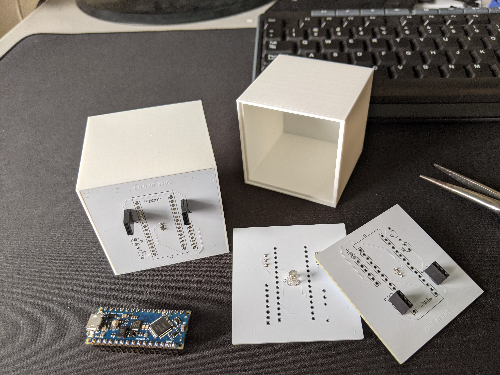

# Cubes
Modular LED cubes that can be controlled via serial port or be allowed to idly
cycle through colors. This source code includes a very simple GUI client in the
`controller` directory.

Crafted as a cumulative project for CS F241 at the University of Alaska
Fairbanks.

## Documentation
Documentation for the serial communication protocol can be found in
[`docs/protocol.md`](docs/protocol.md). Other documentation, such as production
and assembly, will be added as it is created.

## Features
- Simple serial protocol
- Optional GPS support for time-based color changing
- looks pretty neat i think

### The same, but in long form
These cubes implement a simple protocol I created that allows each cube to be
controlled individually. Currently up to 255 cubes can be chained together,
though that can easily change with minor edits to the protocol. Each cube can be
put into one of five modes, independent of the others:

- Disabled. As the name implies, any cubes in this mode are turned off and do
  not receive updates.
- Solid. Any cube in this mode displays a solid color, and does not change.
- Blink. Much like solid, any cube in this mode displays a solid color, in
  addition to turning on and off every other second. Useful for bringing
  attention to something.
- Daylight. This mode uses the optional GPS to shift colors on the cube
  relative to the sun's position. Solar noon will be white, sunset orange, solar
  midnight blue, and sunrise green. If the GPS is not present or does not have a
  fix, any cubes in this mode will be turned off. Currently this mode has some
  issues where changes in color may quickly jump instead of the gradual change
  that they should have.
- Rainbow. This mode cycles cubes through the color wheel. Notably, the color
  distribution of this mode is split evenly across all cubes in the system, so
  with many cubes set to rainbow they will show a smooth gradient across the
  rainbow.

The Arduino refreshes cubes as quickly as it can, so any updates to the system
will be reflected fairly quickly. The ability to perform complex control such
as animations is currently limited primarily by the method of communication as
well as the protocol. Namely, adding a bulk update command to the protocol would
likely allow much smoother and faster updates to the system. In addition,
allowing the use of a "command buffer" that holds updates until given the
go-ahead could allow much more complex control.

The current setup consists of one controller cube and a variable number of
headless cubes that are chained together from the controller cube. The prime
disadvantage to this setup is that the Arduino does not have a way to
dynamically determine the number cubes connected to it, limiting the
optimizations that are able to be made easily.

Current, when started up all cubes are set to solid white - this can be changed
in code, and the possibility of writing the current configuration to EEPROM has
been considered, but not implemented. Connection to a controller is not
required, though without it any fancier features (such as the above documented
modes) will not be available without modification.

## Motivation
The largest motivator behind this is that I've been wanting to create an easily
controllable LED system that I'd be able to use anywhere. Primarily, I wanted
for whatever I created to have a clean design, be easy to control, and as a
bonus, integrate with platforms that I use often (the only one I ended up
getting around to being Discord).

The finished product ended up being (in my opinion) really impressive, and I
learned a lot more skills over the course of creating it than I expected to. PCB
design was a stretch goal that I had that I wasn't sure about at the start of
the project, but in the end I am really proud of the polished and professional
look that it gives the completed cubes.

## Lessons learned
Feature creep is something that I continuously ran into throughout the course of
the project - different features such as wireless communication, network
connectivity, or fancy GUIs got me sidetracked several times, but I was able to
keep scope down to a manageable level.

The prime struggle I ran into on the firmware side was dealing with Arduino's
storage constraints. Sparkfun's [µ-blox library](https://github.com/sparkfun/SparkFun_u-blox_GNSS_Arduino_Library)
(used to communicate with the GPS for date and time) took up over 70% of the
Arduino's memory, and what remained was not enough for the neopixel and
communication control logic.

I didn't run into issues on the hardware side until I had ordered and received
the PCBs - I surprised myself by designing a functioning board first try, though
the issues arose when I tried assembling the hardware. The tools I had at hand
were older and not in the best shape, making it difficult to solder accurately.
Notably, there were several times I accidentally soldered legs of my LEDs
together due to their small size, which was made even more frustrating due to
not having access to solder wick or a similar tool. This resulted in one board
having a power to ground short that I didn't catch until I plugged in and
powered up an Arduino on the board, quickly followed by the Arduino emitting
the dreaded magic smoke. I was much more careful in checking my boards going
forward.

## Where to go from here
From here, I would like to polish the project a bit more, especially on the
controller side. If my time and budget permits, I'd primarily like to focus on
the style of communication between the controller and the cube system, as well
as the means of connection between the individual cubes themselves. As of right
now, a USB serial isn't ideal nor the fastest method of communication, and
jumper cables between each cube isn't the most eye pleasing connection style,
nor the most robust. Very far reaching goals would include looking into surface
mount components rather than through hole for the PCB assembly (which would
allow for a cleaner backface), and potentially wireless communication support
which would make connectivity much easier.

Additionally, better documentation as well as instructions for how to fabricate
and assemble these cubes would be beneficial. Creating a more finished and final
product is something that I am interested in doing, and I may put additional
work into this project over the future if time allows.

## Photos

## A note on the completion of this project
Largely, what needs to be done is all documentation - part lists, schematics, as
well as general assembly instructions. My KiCad project in which I created
schematics and PCBs appears to have been corrupted, so aside from the image
above and gerber files I sent off to fabrication I'll need to work on recreating
them. This will likely become a summer project for me in between semester, as I
work to improve this project.
