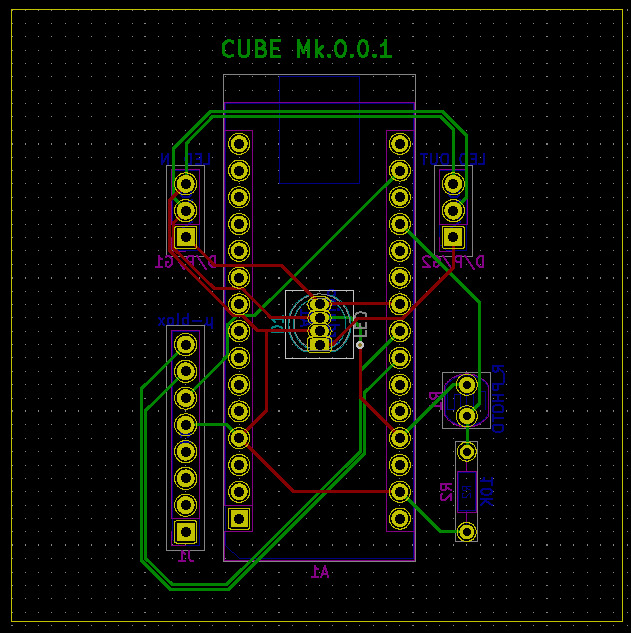

# Cubed
Modular LED cubes that can be controlled via serial port or be allowed to idly
cycle through colors. This source code includes a very simple GUI client in the
`controller` directory.

## Documentation
The serial communication protocol can be found in [`docs/protocol.md`](docs/protocol.md)

## Features
- Simple serial protocol
- Optional GPS support for time-based color changing
- looks pretty neat i think

## Motivation
The largest motivator behind this is that I've been wanting to create an easily
controllable LED system that I'd be able to use anywhere. Primarily, I wanted
for whatever I created to have a clean design, be easy to control, and as a
bonus, integrate with platforms that I use often (the only one I ended up
getting around to being Discord).

The finished product ended up being (in my opinion) really impressive, and I
learned a lot more skills over the course of creating it than I expected to. PCB
design was a stretch goal that I had that I wasn't sure about at the start of
the project, but in the end I am really proud of the polished and professional
look that it gives the completed cubes.

## Lessons Learned
Feature creep is something that I continuously ran into throughout the course of
the project - different features such as wireless communication, network
connectivity, or fancy GUIs got me sidetracked several times, but I was able to
keep scope down to a manageable level.

The prime struggle I ran into on the firmware side was dealing with Arduino's
storage constraints. Sparkfun's [µ-blox library](https://github.com/sparkfun/SparkFun_u-blox_GNSS_Arduino_Library)
(used to communicate with the GPS for date and time) took up over 70% of the
Arduino's memory, and what remained was not enough for the neopixel and
communication control logic.

I didn't run into issues on the hardware side until I had ordered and received
the PCBs - I surprised myself by designing a functioning board first try, though
the issues arose when I tried assembling the hardware. The tools I had at hand
were older and not in the best shape, making it difficult to solder accurately.
Notably, there were several times I accidentally soldered legs of my LEDs
together due to their small size, which was made even more frustrating due to
not having access to solder wick or a similar tool. This resulted in one board
having a power to ground short that I didn't catch until I plugged in and
powered up an Arduino on the board, quickly followed by the Arduino emitting
the dreaded magic smoke. I was much more careful in checking my boards going
forward.

## Where to go from here
From here, I would like to polish the project a bit more, especially on the
controller side. If my time and budget permits, I'd primarily like to focus on
the style of communication between the controller and the cube system, as well
as the means of connection between the individual cubes themselves. As of right
now, a USB serial isn't ideal nor the fastest method of communication, and
jumper cables between each cube isn't the most eye pleasing connection style,
nor the most robust. Very far reaching goals would include looking into surface
mount components rather than through hole for the PCB assembly (which would
allow for a cleaner backface), and potentially wireless communication support
which would make connectivity much easier.

Additionally, better documentation as well as instructions for how to fabricate
and assemble these cubes would be good.

## Images

## A note on the completion of this project
Largely, what needs to be done is all documentation - part lists, schematics, as
well as general assembly instructions. My KiCad project in which I created
schematics and PCBs appears to have been corrupted, so aside from the image
above and gerber files I sent off to fabrication I'll need to work on recreating
them. This will likely become a summer project for me in between semester, as I
work to improve this project.
